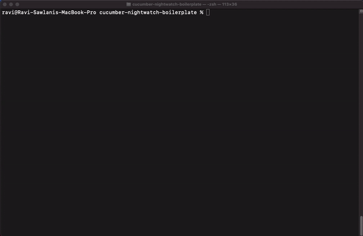

# Nightwatch-CucumberJS Boilerplate

<p align="center">
  
   
</p>

[CucumberJS](https://cucumber.io/) is the one of the popular tools that supports Behaviour Driven Development (BDD). The built-in Cucumber test runner in Nightwatch is bringing the ease of writing test scripts to BDD. 

## Overview
The testcases in Cucumber are written as scenarios in plain language which then maps to code. This project shows some examples of Nightwatch end-to-end tests written using Cucumber. 

## Setup 

To run the tests in the repository:

1. clone the repository: 
   `git clone https://github.com/gravityvi/cucumber-nightwatch-boilerplate.git`
2. install the required dependencies: 
   `npm install`
3. run the tests: 
   `npm test`

## Usage
- there are predefined cucumber steps using nightwatch commands in `src/specs`. 
- add a feature file in `tests/features` using predefined steps and [Gherkin syntax](https://cucumber.io/docs/gherkin/).
- there are some example tests in the folder to demonstrate.
- you can also use tags to filter out tests to run `Eg: npm test -- --tags @nightwatch`.

## Demo


## Adding Tests
You can write tests in Gherkin syntax using the predefined steps from the boilerplate. There are examples under `tests/features`to demonstrate this. You can also extend this boilerplate by defining new steps under `src/specs` to suite your usecase.

## Configuration 
Most of the cucumber options are picked from the Nightwatch config in order to decrease the effort while writing scripts. 

```
{
  test_runner: {
    // set cucumber as the runner
    type: 'cucumber',  
      
    // define cucumber specific options  
    options: {
      //set the feature path
      feature_path: 'examples/cucumber-js/*/*.feature',
      
      // start the webdriver session automatically (enabled by default)
      auto_start_session: true,
    
      // use parallel execution in Cucumber  
      parallel: 2 // set number of workers to use (can also be defined in the cli as --parallel 2
    }
  },
  
  src_folders: ['src/specs']
}
```

- feature path can be given as a string or an Array in the test runner options. All formats of feature path mentioned in [Cucumber CLI](https://github.com/cucumber/cucumber-js/blob/main/docs/cli.md#running-specific-features) are supported.

- Cucumber spec files/step definition files can be provided in `src_folders` in Nightwatch config or as a CLI argument.

## Running

- With `src_folders` defined:

```sh
$ npx nightwatch 
```

 - Without `src_folders` defined:

```sh
$ npx nightwatch src/specs
```
- parallel option can also be supplied as a test-runner option for cucumber. 

- Parallel running using 2 workers:
```sh
$ npx nightwatch src/specs --parallel 2 
```

- You can use [Cucumber tag expression](https://cucumber.io/docs/cucumber/api/#tag-expressions) to filter out scenarios to run. `Eg: nightwatch --tags "@nightwatch and @cucumber"`

- You provide in env flag in order to run test againts multiple envs(chrome, browserstack, etc). `Eg: nightwatch --env chrome,firefox`

- You can also use an extra setup file that can be passed as an extra `--require` to Nightwatch, which will be forwarded to Cucumber:
```sh
$ nightwatch src/specs --require {/full/path/to/_extra_setup.js}
```

- Nightwatch will also forward `--format` and `--format-options` CLI arguements, if present, to Cucumber.

- Use other [test runner options](https://nightwatchjs.org/guide/running-tests/command-line-options.html) as usual:
```sh
$ npx nightwatch src/specs --headless
```

## FAQ

### How to pass in extra capabilities based on scenarios?
By deafault Nightwatch uses scenario name as test name. To update more capabilities we can set `auto_start_session` to `false` in the configuration in order to prevent automatic start of the webdriver session after Nightwatch is intantiated. Nightwatch provides the instance available as `this.client`, which contains `launchBrowser()` and `updateCapabilities` method.

#### Configuration:
```js
test_runner: {
  type: 'cucumber',
  options: {
    feature_path: 'test/*.feature',
    auto_start_session: false
  }
}
```
You can the use an extra setup file that you can pass as an extra `--require` to Nightwatch. In extra setup file, you can add other operations needed to be executed before the session is started

#### Example _extra_setup.js

```js
const {Before} = require('@cucumber/cucumber');

Before(async function(testCase) {
  if (!this.client) {
    console.error('Nightwatch instance was not created.');

    return;
  }

  this.client.updateCapabilities({
    testCap: 'testing'
  });

  this.browser = await this.client.launchBrowser();
});
```

 **Note:** Remember to set the browser on this so it can be closed automatically by Nightwatch. Otherwise, remember to call `.quit()` in your own Cucumber `After()` hooks.
 
 #### Run with extra setup:
 ```sh
 $ nightwatch examples/cucumber-js/features/step_definitions --require {/full/path/to/_extra_setup.js}

 ```

